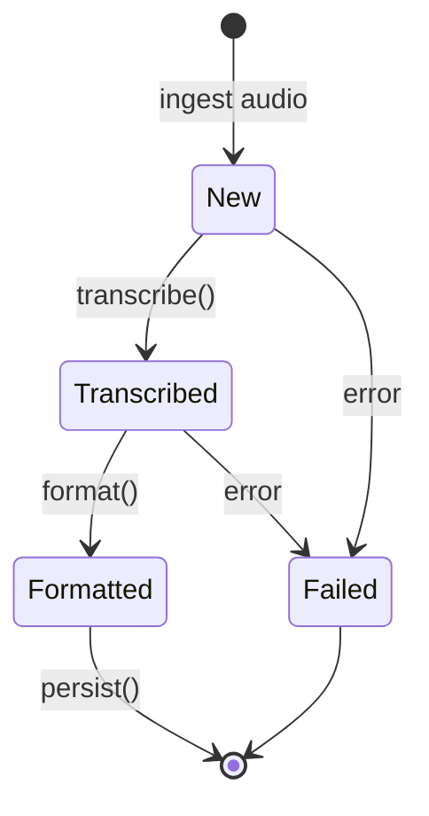
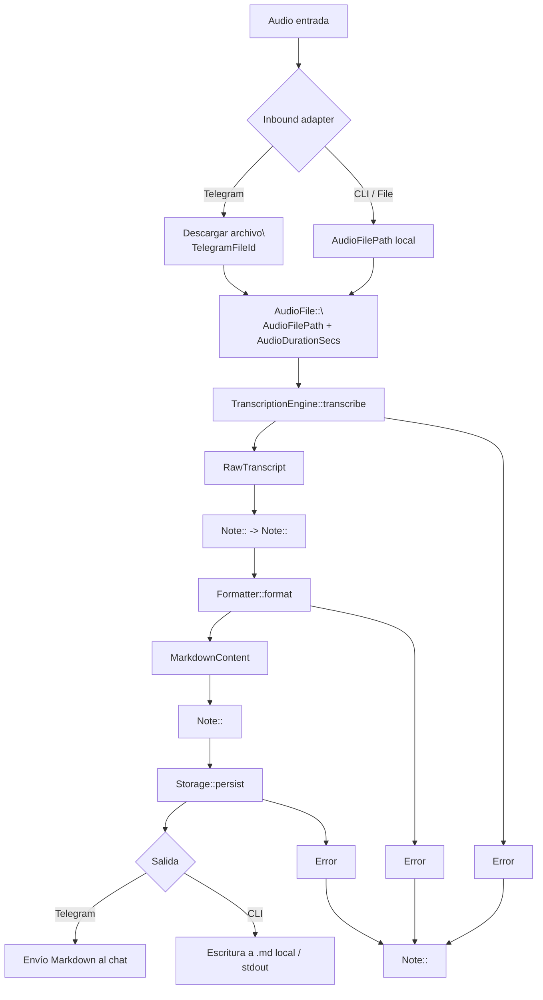

# 01 — Modelo de Dominio

> Fase 1 del SDD. Define entidades, value objects, enums y el pipeline de estados
> (typestate). No contiene decisiones de infraestructura: estas se describen en
> `02-architecture-ports.md`.

## 1. Visión del dominio

El sistema convierte **audio de voz** (notas de voz, grabaciones de clases) en
**documentos Markdown estructurados**, listos para editar en Obsidian/Logseq.

Cadena de valor:

```
Audio crudo  ->  Transcripción  ->  Formateo  ->  Markdown final
```

Cada salto es una transición de estado gobernada por el sistema de tipos. Un
valor mal construido (p. ej. un `MarkdownContent` a partir de un audio que aún
no se transcribió) debe ser **imposible de representar** en tiempo de compilación.

## 2. Value Objects (Newtypes)

Todos son `#[repr(transparent)]` sobre un tipo subyacente. Su único constructor
(`::new` o `TryFrom`) valida las invariantes. No hay `pub` sobre el campo interno.

| Tipo | Subyacente | Invariante |
|------|-----------|------------|
| `AudioFilePath` | `PathBuf` | Ruta absoluta, existe en disco, extensión audio (`wav`, `mp3`, `ogg`, `m4a`, `opus`, `flac`) |
| `RawTranscript` | `String` | No vacío, sin token de fin pendiente (estado "crudo", sin formato) |
| `MarkdownContent` | `String` | No vacío, empieza por un encabezado `#` o frontmatter YAML válido |
| `NoteTitle` | `String` | `1..=180` chars, sin caracteres de control, normalizado (sin `/ \ : * ? " < > |`) |
| `AudioDurationSecs` | `u32` | `> 0` |
| `TelegramChatId` | `i64` | `> 0` |
| `TelegramUserId` | `i64` | `> 0` |
| `TelegramFileId` | `String` | No vacío |
| `LanguageIso` | `String` | Código BCP-47 (`en`, `es`, `de`, `fr`, ...) normalizado a minúsculas |

### Ejemplo de construcción fallble

```rust
impl TryFrom<PathBuf> for AudioFilePath {
    type Error = AudioFileError;
    fn try_from(p: PathBuf) -> Result<Self, Self::Error> {
        let p = p.canonicalize()?; // resolvemos symlinks y hacemos absoluta
        let ext = p.extension().and_then(|e| e.to_str());
        if !SUPPORTED_AUDIO_EXTENSIONS.contains(&ext.unwrap_or_default()) {
            return Err(AudioFileError::UnsupportedExtension(ext.map(String::from)));
        }
        Ok(Self(p))
    }
}
```

> Regla: **nunca** se construye un value object con `unwrap()` sobre el payload.
> Todo camino fallble devuelve un error tipado.

## 3. Entidades

### 3.1 `Note` (entidad raíz)

Representa la nota en proceso. Acompaña al audio a lo largo del pipeline. Es
inmutable: cada transición produce una **nueva** instancia (estilo functional core).

```rust
pub struct Note<State> {
    pub id: NoteId,            // UUIDv4, newtype
    pub title: NoteTitle,
    pub language: LanguageIso,
    pub created_at: DateTime<Utc>,
    pub source: NoteSource,    // enum -> de dónde vino (telegram/cli)
    pub state: State,          // marcador de typestate (ver sección 4)
}
```

`NoteId` es un newtype sobre `uuid::Uuid`.

### 3.2 `NoteSource`

```rust
pub enum NoteSource {
    Telegram { chat_id: TelegramChatId, user_id: TelegramUserId },
    Cli { origin_path: AudioFilePath },
    File { origin_path: AudioFilePath }, // entrada directa por sistema de ficheros
}
```

## 4. Pipeline de Tipos / Typestate

El marcador `State` de `Note` (y su audio asociado) avanza por un número finito
de estados **tipados**. Los métodos de transición solo existen sobre estados
concretos, de modo que el compilador impide saltarse pasos.

```rust
// Estados (unidades de tipo, sin datos o con datos de tipo fantasma)
pub enum New {}          // nota creada, audio sin procesar
pub enum Transcribed {}  // audio transcrito, transcript crudo disponible
pub enum Formatted {}    // transcript ya convertido a Markdown
pub enum Failed {}       // estado terminal de error
```

### 4.1 Transiciones



### 4.2 API por estado (esquema)

```rust
impl Note<New> {
    pub fn transcribe(self, engine: &dyn TranscriptionEngine) -> Result<Note<Transcribed>, Error>;
}

impl Note<Transcribed> {
    pub fn format(self, formatter: &dyn Formatter) -> Result<Note<Formatted>, Error>;
}

impl Note<Formatted> {
    pub fn markdown(&self) -> &MarkdownContent;
}
```

Nótese que `Note<New>` **no** tiene `format()` ni `markdown()`; `Note<Transcribed>`
no tiene `markdown()`. Intentar llamarlos es un error de compilación.

## 5. Diagrama de flujo completo (audio -> Markdown)



## 6. Enums de dominio

### 6.1 `AudioFormat`

```rust
pub enum AudioFormat {
    Wav, Mp3, Ogg, M4a, Opus, Flac,
}
```

### 6.2 `FormattedOutputStyle` (estrategia de formateo)

```rust
pub enum FormattedOutputStyle {
    Obsidian,       // frontmatter YAML + tags
    Logseq,         // bloques con `- ` y propiedades `::`
    Plain,          // Markdown estándar sin frontmatter
}
```

## 7. Reglas de negocio (invariantes del dominio)

1. Un `MarkdownContent` solo puede provenir de un `RawTranscript` vía un `Formatter`.
2. El formateador nunca debe **inventar** contenido: solo estructura/limpia el
   transcript (párrafos, títulos, bullets, código).
3. El título por defecto de una nota es derivado del transcript (primeras ~7
   palabras), recortado a los límites de `NoteTitle`, con fallback a fecha+hash.
4. Los metadatos (fecha, idioma, duración, origen) se preservan en el frontmatter
   cuando el estilo lo soporta.
5. Nada del dominio depende de `reqwest`, `teloxide`, `whisper`, ni del sistema de
   ficheros (excepto `AudioFilePath`, que es un mero contenedor validado).

## 8. Reglas de error del dominio

- Errores de **dominio** (`thiserror`): invariantes violadas, transición ilegal,
  transcript vacío, título inválido.
- Errores de **infraestructura** (`thiserror` en cada crate): red, API de Whisper,
  I/O. Se mapean a `DomainError::Infrastructure` en el boundary.
- `anyhow` **solo** en binarios (CLI y bot), nunca en crates de biblioteca.

---

*Documento vivo. Cambios al modelo de dominio requieren revisar los contratos de
puertos en `02-architecture-ports.md`.*
