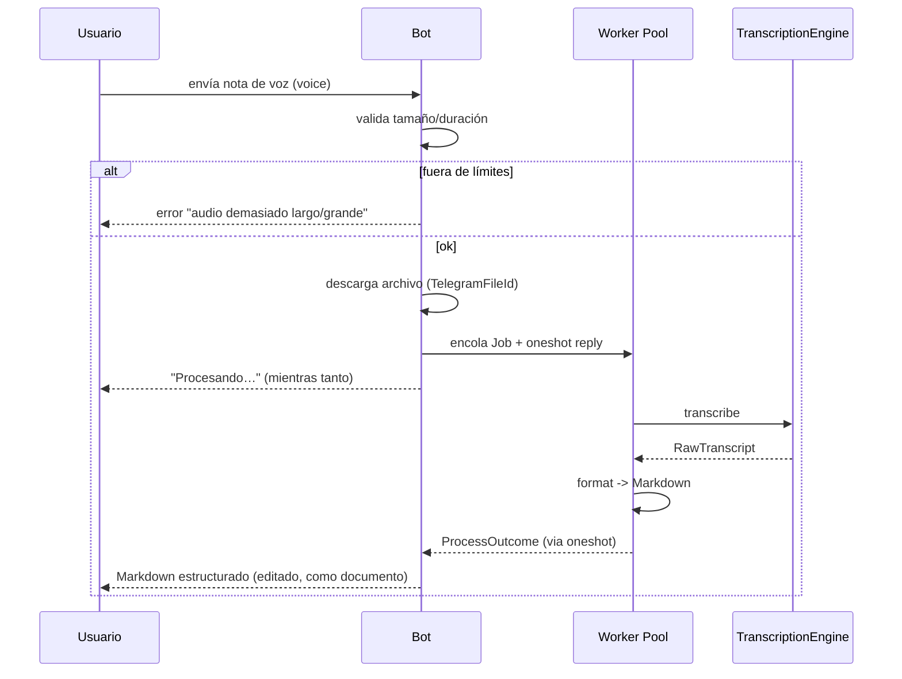

# 03 — Contratos CLI y Bot de Telegram

> Interfaces externas de la aplicación. Definidas antes de implementar para fijar
> la UX y los límites operativos (tamaños, timeouts, errores).

## 1. CLI (crate `cli`)

Parser de argumentos: `clap` con `derive`. Un subcomando por acción.

### 1.1 Árbol de comandos

```
voice2md
├── transcribe <PATH> [opciones]     # procesa un archivo de audio local
├── watch  <DIR> [opciones]          # observa carpeta y procesa nuevos audios
└── config <SUB>                     # genera/valida la config
    ├── init
    └── show
```

### 1.2 `transcribe`

| Flag / Arg | Tipo | Default | Descripción |
|------------|------|---------|-------------|
| `<PATH>` | `PathBuf` | — | Audio a procesar (obligatorio) |
| `--language <LANG>` | `LanguageIso` | `auto` | Idioma BCP-47, o `auto` para detección |
| `--style <STYLE>` | `FormattedOutputStyle` | `obsidian` | `obsidian \| logseq \| plain` |
| `--title <TITLE>` | `String` | derivado | Sobrescribe el título derivado |
| `--out <DIR>` | `PathBuf` | same as input | Directorio de salida del `.md` |
| `--engine <E>` | `EngineKind` | `local` | `local \| remote` |
| `--model <MODEL>` | `String` | `base` | Modelo whisper (`tiny/base/small/medium/large`) |
| `--no-frontmatter` | `bool` | `false` | Omite frontmatter (fuerza estilo `plain` parcial) |
| `--dry-run` | `bool` | `false` | Recorre pipeline sin persistir |

Salida en `--dry-run`: vuelca `MarkdownContent` a `stdout`.

### 1.3 `watch`

| Flag | Tipo | Default | Descripción |
|------|------|---------|-------------|
| `<DIR>` | `PathBuf` | — | Carpeta a vigilar |
| `--recursive` | `bool` | `false` | Vigila subdirectorios |
| `--debounce-ms` | `u64` | `1000` | Debounce para eventos de fichero |
| `--language/--style/--out/--engine/--model` | — | idem `transcribe` | — |

Comportamiento: por cada archivo nuevo con extensión soportada, encola un job y lo
procesa; escribe `<dir>/<nombre>.md`. Logs con `tracing`.

### 1.4 `config`

- `config init`: genera `~/.config/voice2md/config.toml` plantilla si no existe.
- `config show`: imprime la config resuelta (y la fuente de cada valor).

### 1.5 Config (TOML)

```toml
[general]
default_style = "obsidian"
default_language = "auto"

[whisper]
engine = "local"            # local | remote
model = "base"
# remote:
# api_url = "https://api.openai.com/v1"
# api_key_env = "OPENAI_API_KEY"

[output]
out_dir = "."
frontmatter = true
```

### 1.6 Códigos de salida

| Código | Significado |
|--------|-------------|
| `0` | Éxito |
| `1` | Error de dominio (audio inválido, transcript vacío) |
| `2` | Error de infraestructura (I/O, red) |
| `3` | Error de config |
| `130` | Interrupción (Ctrl-C) |

## 2. Bot de Telegram (crate `telegram_bot`)

SDK: `teloxide` sobre `tokio`.

### 2.1 Comandos

| Comando | Descripción |
|---------|-------------|
| `/start` | Bienvenida + instrucciones breve |
| `/help` | Lista de comandos |
| `/style <obsidian\|logseq\|plain>` | Cambia el estilo de salida para el chat |
| `/language <LANG>` | Fija idioma por defecto (`auto` permitido) |

### 2.2 Flujo de interacción (nota de voz)



### 2.3 Límites operativos

| Límite | Valor | Acción al exceder |
|--------|-------|-------------------|
| Duración audio | `300 s` (5 min) | Rechazar con mensaje |
| Tamaño de archivo | `25 MB` | Rechazar con mensaje |
| Mensajes concurrentes por chat | `3` | Encolar o rechazar con backpressure |
| Tamaño de respuesta Markdown | `4096 chars` (límite mensaje) | Partir por secciones, o enviar como documento si excede |
| Timeout de transcripción | `120 s` por job | Marcar fallo y notificar |

### 2.4 Manejo de estado por chat

- Estado por usuario: estilo e idioma activos (persistidos o en memoria `DashMap`).
- Al recibir audio, se lee el estado del chat para `language`/`style`.
- Si una nota excede el límite de mensaje, se envía como **documento** (`.md`) vía
  `sendDocument`.

### 2.5 Manejo de errores hacia el usuario

| Error | Mensaje (es) |
|-------|--------------|
| Audio muy largo | "El audio supera los 5 minutos." |
| Audio muy grande | "El archivo supera 25 MB." |
| Transcripción vacía | "No pude transcribir el audio (sin voz detectable)." |
| Timeout | "La transcripción tardó demasiado; intenta con un audio más corto." |
| Idioma no soportado | "Idioma no soportado: X." |

Todos los mensajes: un solo idioma emisor configurable (por defecto `es`).

## 3. Convenciones de Markdown de salida (ambas interfaces)

- Frontmatter YAML con: `title`, `date`, `language`, `duration`, `source`, `tags`.
- Estructura generada por el `Formatter` (titulos, párrafos, listas, bloques de
  código) — ver `01-domain-model.md` §4.2 y §6.2.

---

*Documento vivo. Los cambios de CLI/bot deben mantener compatibles los comandos o
versionarlos.*
